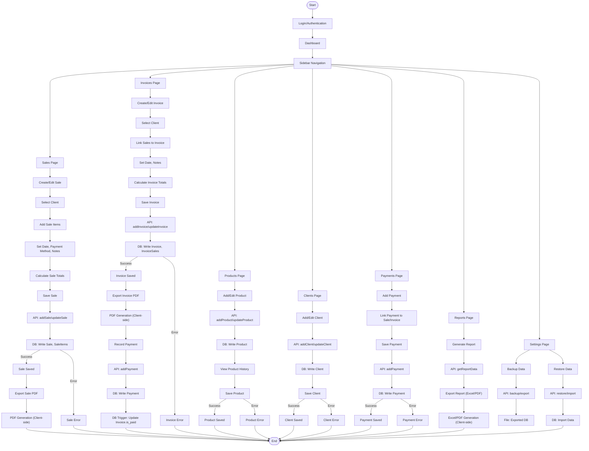

# App Workflow Diagram

This document provides a detailed workflow of the main user journeys in the Coil Commerce Control app, including API and database interactions.

## Legend

- **API:** Calls to backend (Rust/Tauri or Supabase) for CRUD operations.
- **DB:** Database writes/reads (SQLite or Supabase Postgres).
- **Client-side:** Actions performed in the browser (PDF/Excel generation, UI feedback).
- **Triggers:** Database triggers for automatic status updates (e.g., payment status).

---

You can view and edit this diagram using any Markdown viewer that supports Mermaid, or use the [Mermaid Live Editor](https://mermaid.live/). 